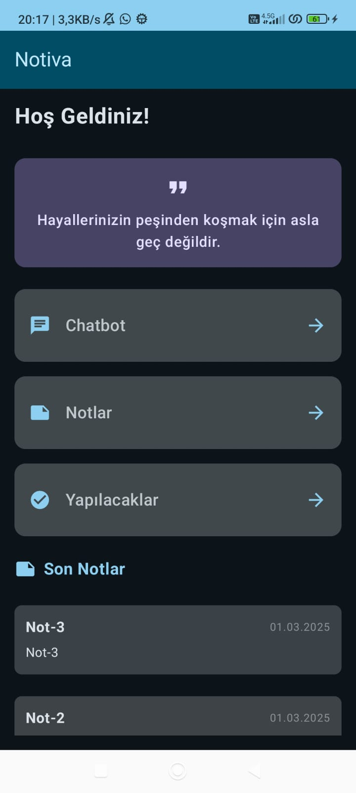
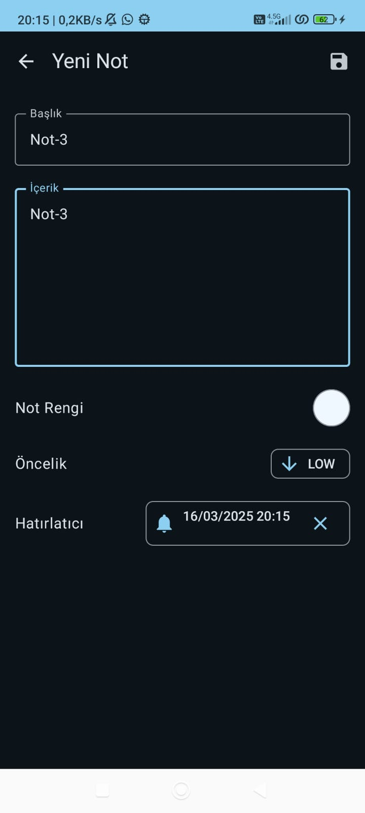
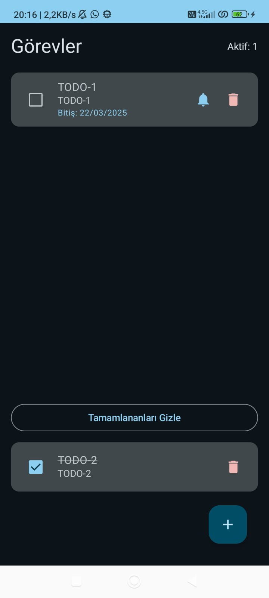
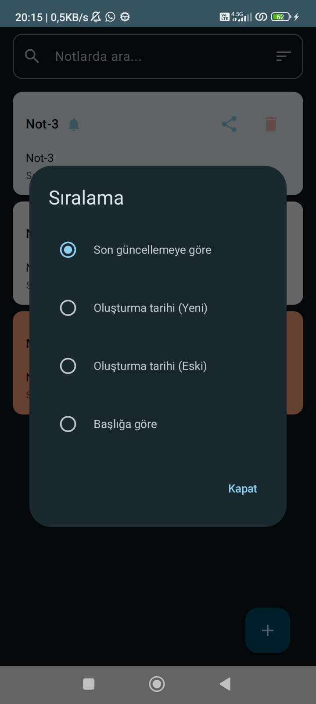
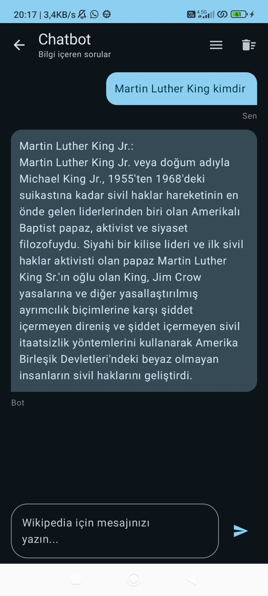
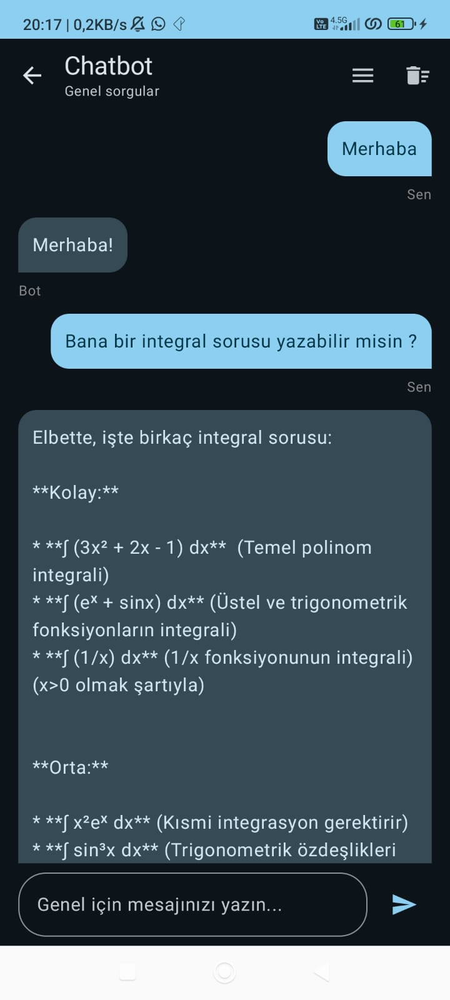
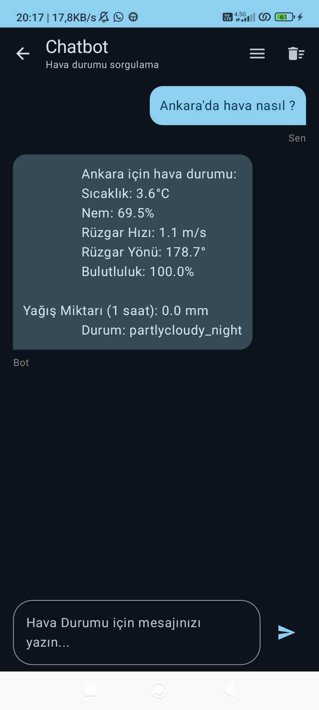

# Notiva - Modern Android Not Alma ve Chatbot Uygulaması

## 📱 Uygulama Özellikleri

Notiva, modern Android teknolojileri kullanılarak geliştirilmiş çok fonksiyonlu bir not alma ve yapay zeka destekli chatbot uygulamasıdır.

### 🎯 Ana Özellikler

#### 📝 Not Alma Modülü
- Renkli ve kategorize edilebilir notlar
- Öncelik seviyeleri (Düşük, Orta, Yüksek)
- Hatırlatıcı ve bildirim sistemi
- Notları paylaşma özelliği
- Gelişmiş arama ve filtreleme

#### ✅ Görev Yöneticisi
- Yapılacaklar listesi oluşturma
- Görevleri önceliklendirme
- Tamamlanma durumu takibi
- Sürükle-bırak ile sıralama
- Alt görevler oluşturma

#### 🤖 AI Chatbot
- Google Gemini AI destekli akıllı asistan
- Türkçe dil desteği
- Bağlam tabanlı sohbet özelliği
- Matematiksel hesaplamalar
- Standart yanıtlar sistemi

### 🛠️ Teknik Mimari ve Yapı

### 📐 Mimari Yaklaşım

#### MVVM (Model-View-ViewModel)
- **Model**: Veri katmanı ve iş mantığı
  - Room veritabanı varlıkları
  - Repository pattern ile veri yönetimi
  - Use-case'ler ile iş mantığı soyutlaması

- **View**: UI katmanı (Jetpack Compose)
  - Declarative UI yaklaşımı
  - State-driven UI tasarımı
  - Composable fonksiyonlar

- **ViewModel**: UI mantığı ve state yönetimi
  - UI state yönetimi
  - Kullanıcı etkileşimleri
  - Veri akışı kontrolü

#### Clean Architecture Prensipleri
- Bağımlılık yönü içten dışa doğru
- Katmanlar arası soyutlama
- SOLID prensiplerine uygunluk
- Modüler ve test edilebilir yapı

### 🛠️ Teknoloji Yığını

#### 1. UI Framework ve Tasarım
- **Jetpack Compose**: Modern UI geliştirme
  - `androidx.compose.ui:ui`: Temel Compose bileşenleri
  - `androidx.compose.material3:material3`: Material Design 3 desteği
  - `androidx.compose.runtime`: Compose runtime
  - `androidx.compose.animation`: UI animasyonları
  - `androidx.compose.foundation`: Temel UI bileşenleri

#### 2. Veritabanı ve Veri Yönetimi
- **Room**: SQLite soyutlaması
  - `androidx.room:room-runtime`: Veritabanı işlemleri
  - `androidx.room:room-ktx`: Kotlin extensions
  - SQL sorgu optimizasyonu

#### 3. Dependency Injection
- **Hilt**: Bağımlılık enjeksiyonu
  - `com.google.dagger:hilt-android`: Android için DI
  - `androidx.hilt:hilt-navigation-compose`: Navigation entegrasyonu
  - Modüler yapı için scope yönetimi

#### 4. Asenkron İşlemler
- **Kotlin Coroutines**: Asenkron programlama
  - `kotlinx.coroutines:coroutines-android`: Android desteği
  - Structured concurrency
  - Exception handling
  - Coroutine scopes

#### 5. Reactive Programming
- **Kotlin Flow**: Reaktif veri akışı
  - `StateFlow`: UI state yönetimi
  - `SharedFlow`: Event handling
  - Flow operators
  - Cold/Hot stream yönetimi

#### 6. Navigation
- **Jetpack Navigation**: Uygulama navigasyonu
  - Type-safe navigation arguments
  - Navigation graph
  - Animasyon geçişleri

#### 7. AI ve API Entegrasyonu
- **Google Gemini AI**: Yapay zeka entegrasyonu
  - `generativeai`: Gemini AI client
  - Context management
  - Error handling

#### 8. State Management
- **UI State Handling**
  - Immutable state prensipleri
  - Single source of truth
  - Unidirectional data flow
  - State hoisting

### 📊 Veri Akışı

```
UI (Compose) ←→ ViewModel ←→ UseCase ←→ Repository ←→ DataSource (Room/API)
```

1. UI Events → ViewModel
2. ViewModel → Business Logic (UseCase)
3. UseCase → Repository
4. Repository → DataSource
5. DataSource → Repository → UseCase → ViewModel → UI

### 📱 Ekran Görüntüleri

<div align="center">
  <h4>Ana Ekran ve Modüller</h4>
  
  <p><i>Notiva'nın ana ekranı - Modüller ve ilham verici alıntı</i></p>
  
  <h4>Not Oluşturma ve Düzenleme</h4>
  
  <p><i>Not detay ekranı - Başlık, içerik, renk seçimi ve hatırlatıcı</i></p>
  
  <h4>Görevler (Yapılacaklar) Listesi</h4>
  
  <p><i>Görevler ekranı - Tamamlanan ve devam eden görevlerin yönetimi</i></p>
  
  <h4>Notlar Listesi ve Sıralama</h4>
  
  <p><i>Notlar listesi ekranı - Farklı sıralama seçenekleri</i></p>
  
  <h4>Chatbot - Wikipedia Bilgi Sorguları</h4>
  
  <p><i>Wikipedia entegrasyonu ile bilgi sorguları</i></p>
  
  <h4>Chatbot - Gemini AI</h4>
  
  <p><i>Gemini AI ile matematik problemleri çözümü</i></p>
  
  <h4>Chatbot - Hava Durumu</h4>
  
  <p><i>Gerçek zamanlı hava durumu sorguları</i></p>
  
  <h4>API Seçim Ekranı</h4>
  
  <p><i>Farklı API servisleri arasında geçiş</i></p>
</div>

### 📥 Kurulum

1. Projeyi klonlayın:
```bash
git clone https://github.com/yourusername/Notiva.git
```

2. Android Studio'da açın ve gerekli bağımlılıkların yüklenmesini bekleyin

3. `local.properties` dosyasına Gemini API anahtarınızı ekleyin:
```properties
GEMINI_API_KEY=your_api_key_here
```

4. Uygulamayı derleyin ve çalıştırın

### 🔧 Gereksinimler

- Android Studio Hedgehog | 2023.1.1 veya üzeri
- Android SDK 34
- Kotlin 1.9.0 veya üzeri
- JDK 17
- Google Play Services (Gemini AI için)

### 📚 Kullanılan Kütüphaneler

```kotlin
dependencies {
    // Compose
    implementation("androidx.compose.ui:ui")
    implementation("androidx.compose.material3:material3")
    
    // Gemini AI
    implementation("com.google.ai.client.generativeai:generativeai:0.1.2")
    
    // Room
    implementation("androidx.room:room-runtime:2.6.1")
    implementation("androidx.room:room-ktx:2.6.1")
    
    // Hilt
    implementation("com.google.dagger:hilt-android:2.50")
    
    // Ve diğerleri...
}
```

### 🤝 Katkıda Bulunma

1. Fork edin
2. Feature branch oluşturun (`git checkout -b feature/AmazingFeature`)
3. Değişikliklerinizi commit edin (`git commit -m 'Add some AmazingFeature'`)
4. Branch'inizi push edin (`git push origin feature/AmazingFeature`)
5. Pull Request oluşturun

### 📄 Lisans

Bu proje MIT lisansı altında lisanslanmıştır. Detaylar için [LICENSE](LICENSE) dosyasına bakın.

### 👥 İletişim

- Proje Linki: [https://github.com/MeteKarasubasi/Notiva](https://github.com/MeteKarasubasi/Notiva)
- LinkedIn: [İsmail Mete Karasubaşı](https://www.linkedin.com/in/ismail-mete-karasuba%C5%9F%C4%B1-253077225/)
